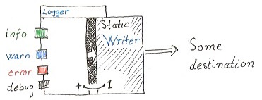

README
======

Logger module for basic logging in php.

* [API reference](http://gregoryv.github.io/php-logger/api/namespace-gregoryv.logger.html)
* [Example](ExampleUsage.php)

Usage
-----

Add to your composer

    {
      "repositories": [
        {
          "type": "vcs",
          "url": "https://github.com/gregoryv/php-logger.git"
        }
      ],
      "require": {
        "gregoryv/php-logger": "*"
      }
    }
